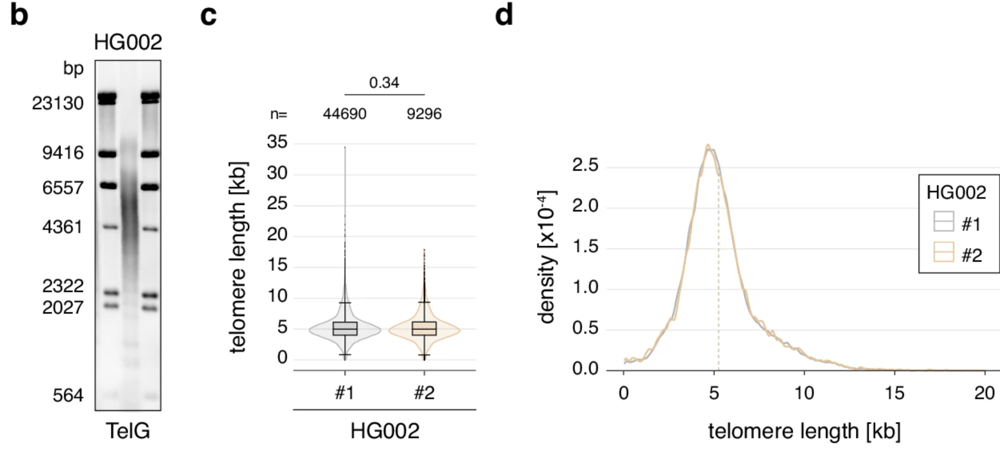

# Data 
The data used in this analysis is the results of comparing the telomere end-chromosome length assaying tools TECAT and Telogator, along with the short read analysis tool Telseq. The data used in this analysis is mostly 1000 genomes project data. The data used in this analysis is 1000 genome project samples HG002, HG003, and HG00731 from the 1000 genomes project. The data was processed using the TECAT, Telogator, and Telseq tools. I chose these samples because they had good matched long-read and short-read data. 

# Analysis workflow
1. Load the data
2. Organize the data
3. Table 1: Data Sets
4. Plot 1: Sensitivity
5. Plot 2: Accuracy
6. Plot 3: Compare Lengths
7. Plot 4: Benchmarks
8. Plot 5: ? 

## Somewhere in here we need to compare workflows in the introduction.

# Purpose 
The purpose of this analysis is to compare the results of the TECAT and Telogator tools to the Telseq tool.

# Introduction to the analysis
The data used in this analysis is the results of comparing the telomere end-chromosome length assaying tools TECAT and Telogator, along with the short read analysis tool Telseq. Telomere lengths are important in determining FCR treatment response in CLL patients and have been shown to be a prognostic marker in CLL and other cancers. Telomere's are also implicated in aging and neurodegenerative diseases. Normal telomere length varies from 1kb to 15kb depending on age. As of now there are two software packages which measure telomere length at the resolution of individual chromosomes: TECAT and Telogator. Telseq is a short read analysis tool that can be used to measure telomere length. The purpose of including Telseq in this analysis is to provide some type of ground truth for the other two tools.

# Setup
```{r setup}
knitr::opts_chunk$set(echo = TRUE)
knitr::opts_knit$set(root.dir = "/home/jake/science_projects/telo/comparative_study")
```

# Libraries
```{r libraries}
library(tidyverse)
library(plyr)
library(knitr)
library(kableExtra)
library(ggplot2)
library(ggpubr)
library(gridExtra)
library(cowplot)
library(reshape2)
```

# Samples
```{r samples}
# Create the data frame, including ineligible rows with a note
data <- data.frame(
  Number = c(1, 2, 3, 4, 5, 6, 7, 8, 9, "-10", "-11", "-12", 10, 11, 12),
  SampleID = c("HG002", "HG003", "HG004", "HG00731", "HG00732", "HG02011", 
               "HG02492", "HG03065", "HG03371", "HG03683", "NA12329", 
               "NA19983", "HG00514", "HG00733", "NA19240"),
  `Long Read Accession` = c("SRR28295757-71", "SRR12898316", "SRR27010837", 
                          "ERR11586165", "ERR4987503-05", "ERR11028132", 
                          "ERR11028099", "ERR11028096", "ERR11028137", 
                          "ERR3861403", "ERR3861409-10", "ERR3861402", 
                          "ERR4982327", "SRR24401966", "ERR3219853-57"),
  Short_Read_Accession = c("SRR14724532", "SRR14724530", "SRR14724529", 
                           "ERR10967205", "ERR3241755", "ERR3988973", 
                           "ERR3989019", "ERR3989118", "ERR3989162", 
                           "ERR3989199", "ERR3989317", "ERR3989454", 
                           "ERR3988781", "SRR5535410-11", "ERR3989410"),
  Type = c("ONT", "ONT", "ONT", "ONT", "PB", "ONT", "ONT", "ONT", 
              "ONT", "PB", "PB", "PB", "PB", "ONT", "ONT"),
  Notes = c("", "", "", "updated SR SRR5534404-5", "", "", "", "", "", 
            "CLR - not eligible", "CLR - not eligible", "CLR - not eligible", "", "", "")
)

# Remove the samples where the sample number has a negative sign
data <- data[!grepl("-", data$Number), ]
data <- data[, 1:5]
df <- data

# Current samples list
samples <- c("HG002", "HG004", "HG00731", "HG00732", "HG02011", "HG02492", "HG03065", "HG03371", "HG00514")
```

# Publication ready table
```{r table}
sample_table <- kable(df, 
       format = "html",
       col.names = c("Sample Number", "Sample ID", "Long Read Accession", "Short Read Accession", "Type"), 
       row.names = FALSE, 
       align = c("c", "c", "c", "c", "c"), 
       caption = "<font style='font-size:16pt'><b>Table 1</b> Sample Data</font>") %>%
 kable_classic(full_width = FALSE, html_font = "Arial", font_size = 14)
# kableExtra::save_kable(sample_table, file = "./results/paper_figures/sample_table.png", density = 600, zoom = 1.5)

sample_table
```

# Sensitivity
```{r sensitivity}
# Retrieve the data
tecat_reads <- list()
telogator_reads <- list()

for(s in samples) {
    tecat_reads[[s]] <- as.numeric(strsplit(grep("Number of telomeres", readLines(file.path("./code/logs", paste0(s, ".log"))), value = TRUE), ":")[[1]][2])
    telogator_grep <- "^ -"
    line <- grep(telogator_grep, readLines(file.path("./code/logs", paste0(s, ".log"))), value = TRUE)[[3]]
    telogator_reads[[s]] <- as.numeric(gsub("reads", "", strsplit(line, "-->")[[1]][2]) )
}

raw <- data.frame()
for(s in samples) {
    raw <- rbind(raw, data.frame(Sample = s, TECAT = tecat_reads[[s]], Telogator = telogator_reads[[s]]))
}

head(raw)
```

## Plotting sensitivity
```{r plot_sensitivity, fig.align = "center", fig.width = 8, fig.height = 8}
sens <- raw %>%
  gather(key = "Tool", value = "Number of Telomeres Captured", -Sample) %>%
  ggbarplot(x = "Sample", y = "Number of Telomeres Captured", fill = "Tool", 
            position = position_dodge(0.8), 
            title = "Sensitivity of TECAT and Telogator",
            xlab = "Sample",
            ylab = "Number of Telomeres Captured",
            legend.title = "Tool",
            legend.position = "top",
            theme.legend.position = "top",
            theme = theme_pubr(),
            show.values = TRUE) +
            rotate_x_text(45)

sens

perc <- raw$Telogator / raw$TECAT

perc

mean(c(0.33, 0.76, 0.28, .02, .25, .25, .36, .21, 1.30))

# Save plot
#ggsave(file = "./results/paper_figures/sensitivity_plot.png", plot = sens, width = 8, height = 6)
```

# Accuracy
```{r accuracy}
# Retrieve the data
tecat <- list()
telogator <- list()
telseq <- list()
for(s in samples) {
  tecat[[s]] <- readRDS(file = file.path("results", paste0(s), "tecat", "mapped.rds"))
  telogator[[s]] <- read.table(file = file.path("results", paste0(s), "telogator", "tlens_by_allele.tsv"), header = TRUE, sep = "\t", comment.char = "")
  telseq[[s]] <- readLines(file.path("results", paste0(s), "telseq", "telseq_results.txt"))
}

head(tecat$HG002$results)
dim(telogator$HG002)
dim(tecat$HG002$results)
names(telogator$HG002)
telogator$HG002[1:5,1:6]
```

## Collect telomere lengths
```{r}
tecat_lengths <- list()
telogator_lengths <- list()
telseq_length <- list()
for(s in samples) {
    tecat_lengths[[s]] <- tecat[[s]]$results %>% 
        filter(!is.na(telomere_length)) %>% 
        pull(telomere_length)
    telogator_lengths[[s]] <- as.numeric(unlist(strsplit(telogator[[s]]$read_TLs, ",")))
    telseq_length[[s]] <- as.numeric(unlist(strsplit(telseq[[s]][4], "\t"))[7])
}
```

## Basic plots of data
{width=45%} {width=45%}
```{r density, fig.align = "center", fig.width = 12, fig.height = 8}
histo_data <- list()
for(s in samples) {
    histo_data[[s]] <- data.frame(
        length = c(tecat_lengths[[s]], telogator_lengths[[s]]),
        Tool = c(rep("TECAT", length(tecat_lengths[[s]])), rep("TELOGATOR", length(telogator_lengths[[s]])))
    )  
}

# Initially just HG002
hg002 <- histo_data[["HG002"]]
line <- c(5247)
dens <- ggdensity(data = hg002, x = "length", fill = "Tool", 
          add = "mean",
          color = "Tool", 
          rug = TRUE,
          title = "Telomere Lengths from TECAT and Telogator for HG002",
          xlab = "Telomere Length",
          ylab = "Density",
          legend.title = "Tool",
          legend.position = "top",
          theme = theme_pubr())
dens <- dens + geom_vline(aes(xintercept = line, linetype = "Schmidt\ 2024")) +
  scale_fill_manual(name = "Tool",
                    values = c("TECAT" = "#F8766D", "TELOGATOR" = "#00BFC4")) +
  scale_linetype_manual(name = "Literature", 
                        values = "dashed") +
  theme(legend.position = "right")

dens

# Save plot
ggsave(file = "./results/paper_figures/density_plot.png", plot = dens, width = 12, height = 6)
```

# Descriptive statistics of each sample
```{r descriptive}

# Create a data frame with the mean, median, and standard deviation of each sample
descriptive <- data.frame(
  Sample = samples,
  TECAT_Mean = sapply(tecat_lengths, mean),
  TECAT_Median = sapply(tecat_lengths, median),
  TECAT_SD = sapply(tecat_lengths, sd),
  TELOGATOR_Mean = sapply(telogator_lengths, mean),
  TELOGATOR_Median = sapply(telogator_lengths, median),
  TELOGATOR_SD = sapply(telogator_lengths, sd),
  TELSEQ_Mean = sapply(telseq_length, mean),
  TELSEQ_Median = sapply(telseq_length, median),
  TELSEQ_SD = sapply(telseq_length, sd)
)

# Create a table with the descriptive statistics
descriptive_table <- kable(descriptive, 
                            format = "html",
                            col.names = c("Sample", "TECAT Mean", "TECAT Median", "TECAT SD", 
                                          "TELOGATOR Mean", "TELOGATOR Median", "TELOGATOR SD", 
                                          "TELSEQ Mean", "TELSEQ Median", "TELSEQ SD"), 
                            row.names = FALSE, 
                            align = c("c", "c", "c", "c", "c", "c", "c", "c", "c", "c"), 
                            caption = "<font style='font-size:16pt'><b>Table 2</b> Descriptive Statistics of Telomere Lengths</font>") %>%
  kable_classic(full_width = FALSE, html_font = "Arial", font_size = 14)

descriptive_table

# May include this in the publication, need to work it out
```


## Boxplot of telomere lengths
```{r boxplot, fig.width = 12, fig.height = 8, fig.align = "center"}
# Combine histo datas for both samples with sample labels
boxplot <- rbind(
    cbind(histo_data[["HG002"]], sample = "HG002"),
    cbind(histo_data[["HG004"]], sample = "HG004"),
    cbind(histo_data[["HG00731"]], sample = "HG00731"), 
    cbind(histo_data[["HG00732"]], sample = "HG00732"),
    cbind(histo_data[["HG02011"]], sample = "HG02011"),
    cbind(histo_data[["HG02492"]], sample = "HG02492"), 
    cbind(histo_data[["HG03065"]], sample = "HG03065"), 
    cbind(histo_data[["HG03371"]], sample = "HG03371"), 
    cbind(histo_data[["HG00514"]], sample = "HG00514")
)

# Add telseq data to boxplot
boxplot <- rbind(
    boxplot,
    data.frame(
        length = unlist(telseq_length) * 1000,
        Tool = rep("TELSEQ", length(unlist(telseq_length))),
        sample = rep(samples, each = 1)
    )
)

boxplot$Tool <- factor(boxplot$Tool, levels = c("TECAT", "TELSEQ", "TELOGATOR"))

box <- ggplot() +
  # Layer for TECAT and TELOGATOR with boxplots
  geom_boxplot(data = subset(boxplot, Tool != "TELSEQ"), 
               aes(x = sample, y = length, fill = Tool, color = Tool, linetype = Tool)) +
  # Layer for TELSEQ with just a line in legend
  geom_boxplot(data = subset(boxplot, Tool == "TELSEQ"),
               aes(x = sample, y = length, color = Tool, linetype = Tool),
               show.legend = TRUE,
               key_glyph = "path") +
  scale_fill_manual(values = c("#F8766D", "#00BFC4", "#228B22")) +
  scale_color_manual(values = c("black", "black", "#228B22")) +
  scale_linetype_manual(values = c("solid", "solid", "solid")) +
  labs(title = "Telomere Lengths LRS Tools and Telseq",
       x = "Sample",
       y = "Telomere Length (bp)",
       color = "Tool") +
  theme_pubr() +
  theme(legend.position = "top",
        legend.box = "vertical",
        legend.margin = margin(0, 0, 0, 0),  # Reduce margin around each legend
        legend.spacing = unit(0.1, "cm"),     # Reduce space between legends
        legend.key.size = unit(0.8, "lines"), # Make legend keys smaller
        axis.text.x = element_text(angle = 45, hjust = 1))

box

# Perform t-tests for each sample
tecat_tests <- lapply(samples, function(s) {
  wilcox.test(boxplot[["length"]][boxplot[["Tool"]] == "TECAT" & boxplot[["sample"]] == s], 
         mu = boxplot[["length"]][boxplot[["Tool"]] == "TELSEQ" & boxplot[["sample"]] == s])
})

telogator_tests <- lapply(samples, function(s) {
  wilcox.test(boxplot[["length"]][boxplot[["Tool"]] == "TELOGATOR" & boxplot[["sample"]] == s], 
         mu = boxplot[["length"]][boxplot[["Tool"]] == "TELSEQ" & boxplot[["sample"]] == s])
})

# Extract p-values
tecat_pv <- sapply(tecat_tests, function(t) t$p.value)
telogator_pv <- sapply(telogator_tests, function(t) t$p.value)

# Create a data frame with the p-values
p_values_df <- data.frame(
  Sample = samples,
  TECAT = tecat_pv,
  TELOGATOR = telogator_pv
)

# First reshape p_values_df to long format for easier plotting
p_values_df <- tidyr::pivot_longer(p_values_df, 
                                   cols = c("TECAT", "TELOGATOR"),
                                   names_to = "Method", 
                                   values_to = "p_value")

pvalue_plot <- data.frame(
 Sample = samples,
 TECAT = -log10(tecat_pv),
 TELOGATOR = -log10(telogator_pv)
)

# Heatmap with just exponent values
pplot <- ggplot(pvalue_plot, aes(y=Sample)) +
 geom_tile(aes(x="TECAT", fill=TECAT)) +
 geom_tile(aes(x="TELOGATOR", fill=TELOGATOR)) +
 scale_fill_gradientn(
   colors = c("white", "orange", "red"),
   name="p-value (10^-x)",
   breaks=seq(0, max(c(pvalue_plot$TECAT, pvalue_plot$TELOGATOR)), length.out=5),
   labels=function(x) round(x)
 ) +
 geom_text(aes(x="TECAT", label=round(TECAT)), color="black", size=3) +
 geom_text(aes(x="TELOGATOR", label=round(TELOGATOR)), color="black", size=3) +
 theme_pubr() +
 labs(x="", y="Sample") +
 ggtitle("LRS Tools Significance") + 
 coord_flip() + 
 rotate_x_text(45)


# Create a plot that shows the difference between each method and the telseq method/tool
# Calculate the mean of each method
tecat_means <- sapply(tecat_lengths, mean)
telogator_means <- sapply(telogator_lengths, mean)
telseq_means <- sapply(telseq_length, mean)

means <- data.frame(
    sample = samples,
    tecat = tecat_means,
    telogator = telogator_means,
    telseq = telseq_means
)

diff <- data.frame(
    sample = samples,
    tecat = means$tecat - means$telseq * 1000,
    telogator = means$telogator - means$telseq * 1000
)

diff_plot <- diff %>%
    gather(key = "Tool", value = "Difference", -sample) %>%
    ggbarplot(x = "sample", y = "Difference", fill = "Tool", 
              position = position_dodge(0.8), 
              title = "Difference in Telomere Lengths",
              xlab = "Sample",
              ylab = "Difference in Telomere Length (bp)",
              legend.title = "Tool",
              legend.position = "top",
              theme = theme_pubr(),
              show.values = TRUE) +
              rotate_x_text(45)

# Violin plot of all data with samples combined based on tool
violin_data <- boxplot[, c(1,2)]

# Violin plot with stat comparison
violin <- ggviolin(violin_data, x = "Tool", y = "length", fill = "Tool",
                   palette = c("#F8766D", "#42f606", "#00BFC4"),
                   xlab = "Method",
                   ylab = "Length") +
 stat_compare_means(method = "wilcox.test",
                    comparisons = list(c("TECAT", "TELSEQ"),
                                       c("TELOGATOR", "TELSEQ")),
                    label = "p.signif") +
 geom_boxplot(width = 0.2, outlier.shape = 16) +
 theme_pubr() +
 theme(legend.position = "none") +
 ggtitle("Combined Telomere Lengths")

#grid.arrange(box, diff_plot, pplot, violin, ncol = 2, nrow = 2)

#grid <- grid.arrange(box, diff_plot, pplot, violin, ncol = 2, nrow = 2, )

diff %>% 
    summarise(tecat = mean(abs(tecat)), telogator = mean(abs(telogator)))
diff %>%
    summarise(tecat = sum(abs(tecat)), telogator = sum(abs(telogator)))
diff %>% 
    summarise(tecat = sd(abs(tecat)), telogator = sd(abs(telogator)))
```

## Combine plots
```{r combine}
diff_plot
pplot
violin

grid_a <- plot_grid(
  box,                              # First plot takes full width
  plot_grid(diff_plot, pplot,            # Second row has two plots
            ncol = 2, 
            labels = c("B", "C")),
  ncol = 1,                          # Stack the rows vertically
  rel_heights = c(1, 1),             # Adjust relative heights of rows
  labels = c("A", ""), 
  label_size = 20               # Label only the top plot
)

#grid_a <- plot_grid(box, diff_plot, ncol = 1, nrow = 2, labels = "AUTO", label_size =20)

#grid_b <- plot_grid(pplot, violin, ncol = 1, nrow = 2, labels = "AUTO", label_size =20)

# Save plot
ggsave(file = "./results/paper_figures/grid_a.png", plot = grid_a, width = 8, height = 8)
#ggsave(file = "./results/paper_figures/grid_b.png", plot = grid_b, width = 6, height = 8)
#ggsave(file = "./results/paper_figures/length_violin.png", plot = violin, width = 6, height = 6)

# Mean difference
diff %>% 
    summarise(tecat = abs(mean(tecat)), telogator = abs(mean(telogator)))
# Sum of differences
diff %>% 
    summarise(tecat = abs(sum(tecat)), telogator = abs(sum(telogator)))
```

# Linear comparison of telomere lengths
```{r linear}
telseq_line <- data.frame(
    sample = samples,
    length = unlist(telseq_length) * 1000,
    tool = rep("TELSEQ", length(unlist(telseq_length)))
)

# Order telse from least to greatest
telseq_line <- telseq_line[order(telseq_line$length), ]
telseq_samples <- telseq_line$sample

# Get means for each tool per sample
tecat_means <- sapply(tecat_lengths, mean)

# Order tecat from least to greatest
tecat_line <- data.frame(
    sample = samples,
    length = tecat_means,
    tool = rep("TECAT", length(tecat_means))
)

# Take sample order from telseq and apply it to tecat 
tecat_line <- tecat_line[match(telseq_samples, tecat_line$sample), ]

# Get means for telogator tool
telogator_means <- sapply(telogator_lengths, mean)

# Order telogator from least to greatest
telogator_line <- data.frame(
    sample = samples,
    length = telogator_means,
    tool = rep("TELOGATOR", length(telogator_means))
)

# Take sample order from telseq and apply it to telogator
telogator_line <- telogator_line[match(telseq_samples, telogator_line$sample), ]

# Combine all data with tool annotations
line_data <- rbind(telseq_line, tecat_line, telogator_line)

# Convert data to long form
line_data <- data.frame(
    sample = rep(samples, 2), 
    x <- rep(telseq_line$length, 2),
    y <- c(tecat_line$length, telogator_line$length), 
    Tool = rep(c("TECAT", "TELOGATOR"), each = length(samples))
)
colnames(line_data) <- c("sample", "x", "y", "Tool")

# Perform regression for each group
fits <- line_data %>%
  group_by(Tool) %>%
  do({
    mod <- lm(y ~ x, data = .)
    data.frame(r2 = summary(mod)$r.squared)
  })

# Plot with group-specific regression lines and R-squared values
lines <- ggplot(line_data, aes(x = x, y = y, color = Tool)) +
  geom_point() +
  geom_smooth(method = "lm", se = FALSE, linewidth = 2) +
  annotate("text", x = min(line_data$x) * 3, y = max(line_data$y) * 1.5, 
           label = paste("TECAT R² =", round(fits$r2[fits$Tool == "TECAT"], 2)), 
           color = "#F8766D", 
           size = 5, 
           fontface = "bold") +
  annotate("text", x = min(line_data$x) * 3, y = max(line_data$y) * 1.4, 
           label = paste("TELOGATOR R² =", round(fits$r2[fits$Tool == "TELOGATOR"], 2)), 
           color = "#00BFC4", 
           size = 5, 
           fontface = "bold") +
  theme_pubr() +
  ggtitle("Linear Comparison of Telomere Lengths") +
  theme(plot.title = element_text(size = 20),
       legend.title = element_text(size = 20),  # Legend title font size
       legend.text = element_text(size = 20)) +
  xlab("Telseq Length") +
  ylab("TECAT and TELOGATOR Lengths") +
  scale_color_manual(values = c("#F8766D", "#00BFC4"))

lines

# Save plot
ggsave(file = "./results/paper_figures/lines.png", plot = lines, width = 8, height = 6)
```

# Time Benchmarks for Each LRS Tool
```{r, out.width="80%"}
tecat_time <- list()
telogator_time <- list()

for(s in samples) {
    tecat_time[[s]] <- as.numeric(strsplit(grep("TECAT time taken", readLines(file.path("./code/logs", paste0(s, ".log"))), value = TRUE), ":")[[1]][2])
    telogator_time[[s]] <- as.numeric(strsplit(grep("Telogator time taken", readLines(file.path("./code/logs", paste0(s, ".log"))), value = TRUE), ":")[[1]][2])
}

time_data <- data.frame()
for(s in samples) {
    time_data <- rbind(
        time_data,
        data.frame(
            time = c(tecat_time[[s]], telogator_time[[s]]),
            tool = c(rep("TECAT", 1), rep("TELOGATOR", 1)),
            sample = c(rep(s, 2))
        )
    )
}

# Convert time from seconds to minutes and label minutes
#time_data$time <- time_data$time / 60

# Summarise data again
wide <- pivot_wider(time_data, names_from = tool, values_from = time)

wide %>%
    summarise(tecat = sum(TECAT), telogator = sum(TELOGATOR))

wide %>%
    summarise(tecat = mean(TECAT), telogator = mean(TELOGATOR))

wide %>%
    summarise(tecat = sd(TECAT), telogator = sd(TELOGATOR))

# Add a size column to wide
wide$num_reads <- c(5250126, 10090702, 892957, 3326365, 869956, 731859, 1018035, 704905, 1530335)
wide$total_size_bp <- c(136833783166, 51037036142, 49544043330, 76194665538, 61543667300, 49692498960, 76207584238, 65197619090, 25992945599)

# Reorder data based on seconds taken
wide <- wide[order(wide$TECAT), ]
wide$TECAT_mbpsec <- wide$total_size_bp / wide$TECAT / 10^6
wide$TELOGATOR_mbpsec <- wide$total_size_bp / wide$TELOGATOR / 10^6
wide

long <- melt(wide, id.vars = c("sample", "num_reads", "total_size_bp"), measure.vars = c("TECAT", "TELOGATOR"))

long$mbppsec <- long$total_size_bp / long$value / 10^6

colnames(long) <- c("Sample", "Number of Reads", "Total Size (bp)", "Tool", "Time (s)", "MB per s")

# MB/s violin
time_violin <- ggviolin(long, x = "Tool", y = "MB per s", fill = "Tool",
          palette = c("#F8766D", "#00BFC4"),
          xlab = "Method",
          ylab = "MB/s", 
          trim = TRUE) +
    geom_boxplot(width = 0.2, outlier.shape = 16) +
    theme_pubr() +
    ggtitle("MB/s Benchmarks for Each LRS Tool")
time_violin

mean(long$'MB per s'[long$Tool == "TECAT"]) / mean(long$'MB per s'[long$Tool == "TELOGATOR"])

mean(long$'Time (s)'[long$Tool == "TECAT"]) / mean(long$'Time (s)'[long$Tool == "TELOGATOR"])


# time_violin <- ggviolin(time_data, x = "tool", y = "time", fill = "tool",
#           palette = c("#F8766D", "#00BFC4"),
#           xlab = "Method",
#           ylab = "Time (minutes)", 
#           trim = TRUE) +
#     geom_boxplot(width = 0.2, outlier.shape = 16) +
#     theme_pubr() +
#     ggtitle("Time Benchmarks for Each LRS Tool")
  
# time_violin
# Save plot
#ggsave(file = "./results/paper_figures/time_violin.png", plot = time_violin, width = 8, height = 6)

hist(wide$TECAT, breaks = 10, col = "red", xlab = "Time (s)", main = "TECAT Time Distribution")
hist(wide$TELOGATOR, breaks = 10, col = "blue", xlab = "Time (s)", main = "TELOGATOR Time Distribution")
```

# Estimate cost per sample
```{r cost}
# Cost per sample
consumption <- 45
cost_per_kwh <- 0.12
tecat_cost_s <- mean(long$'Time (s)'[long$Tool == "TECAT"]) * consumption / 360000 * cost_per_kwh
telogator_cost_s <- mean(long$'Time (s)'[long$Tool == "TELOGATOR"]) * consumption / 360000 * cost_per_kwh

# Cost per GB
tecat_cost_gb <- tecat_cost_s / (mean(long$'Total Size (bp)'[long$Tool == "TECAT"]) / 10^9) * 100
telogator_cost_gb <- telogator_cost_s / (mean(long$'Total Size (bp)'[long$Tool == "TELOGATOR"]) / 10^9) * 100

cost_df <- data.frame(
  Tool = c("TECAT", "TELOGATOR"),
  Cost_per_100GB = c(tecat_cost_gb, telogator_cost_gb),
  Cost_per_Sample = c(tecat_cost_s, telogator_cost_s)
)

knitr::kable(cost_df, 
             format = "html",
             col.names = c("Tool", "Cost per 100GB ($)", "Cost per Sample ($)"), 
             row.names = FALSE, 
             align = c("c", "c", "c"), 
             caption = "<font style='font-size:16pt'><b>Table 3</b> Cost Estimates</font>") %>%
  kable_classic(full_width = FALSE, html_font = "Arial", font_size = 14)
```

# Reformat the telogator data for 5' and 3' arms instead of p or q arms
```{r reformat}
dict <- data.frame(
  X.chr = c("chr1p", "chr1q", "chr2p", "chr2q", "chr3p", "chr3q", "chr4p", "chr4q", 
          "chr5p", "chr5q", "chr6p", "chr6q", "chr7p", "chr7q", "chr8p", "chr8q", 
          "chr9p", "chr9q", "chr10p", "chr10q", "chr11p", "chr11q", "chr12p", "chr12q", 
          "chr13q", "chr13p", "chr14q", "chr14p", "chr15q", "chr15p", "chr16p", "chr16q", 
          "chr17p", "chr17q", "chr18p", "chr18q", "chr19p", "chr19q", "chr20p", 
          "chr20q", "chr21q", "chr21p", "chr22q", "chr22p", "chrXp", "chrXq", "chrYp", 
          "chrYq"),
  prime_arm = c("5'", "3'", "5'", "3'", "5'", "3'", "5'", "3'", 
                "5'", "3'", "5'", "3'", "5'", "3'", "5'", "3'", 
                "5'", "3'", "5'", "3'", "5'", "3'", "5'", "3'", 
                "5'", "3'", "5'", "3'", "5'", "3'", "5'", "3'", 
                "5'", "3'", "5'", "3'", "5'", "3'", "5'", "3'", 
                "5'", "3'", "5'", "3'", "5'", "3'", "5'", "3'")
)

# Redo previous plot and use the dictionary to convert all to 5' and 3'
samples <- c("HG002")

for (s in samples) {
  mapped_output <- tecat[[s]]
  left <- mapped_output[["results"]][mapped_output[["results"]]$chromEnd == "5'", ]
  ord <- order(as.numeric(stringr::str_extract(left$ref_name, "\\d+")))
  left <- left[ord, ]
  left$ref_name <- factor(left$ref_name, levels = unique(left$ref_name))
  right <- mapped_output[["results"]][mapped_output[["results"]]$chromEnd == "3'", ]
  ord <- order(as.numeric(stringr::str_extract(right$ref_name, "\\d+")))
  right <- right[ord, ]
  right$ref_name <- factor(right$ref_name, levels = unique(right$ref_name))
  top <- ggplot(left, aes(x = ref_name, y = telomere_length / 1000, fill = chromEnd)) +
    geom_violin(drop = FALSE) +
    geom_boxplot(width = 0.1) +
    scale_fill_manual(values = c("#0091ff")) +
    labs(x = "Chromosome", 
      y = "Telomere Length (kb)", 
      title = paste("TECAT Lengths by Chromosome End 5'", s)) +
      theme(text = element_text(size = 18, family = "Arial")) +
      theme_pubr() +
      theme(axis.text.x = element_text(angle=90, vjust=.5, hjust=1)) +
      theme(legend.position = "none")

  bottom <- ggplot(right, aes(x = ref_name, y = telomere_length / 1000, fill = chromEnd)) +
    geom_violin(drop = FALSE) +
    geom_boxplot(width = 0.1) +
    scale_fill_manual(values = c("#ff00b7")) +
    labs(x = "Chromosome", 
      y = "Telomere Length (kb)", 
      title = paste("TECAT Lengths by Chromosome End 3'", s)) + 
      theme(text = element_text(size = 18, family = "Arial")) +
      theme_pubr() +
      theme(axis.text.x = element_text(angle=90, vjust=.5, hjust=1)) +
      theme(legend.position = "none")
      

  grid <- plot_grid(top, bottom, ncol = 1)
  tecat <- grid
  print(grid)

  # Save Plot
  #ggsave(file = file.path("./results/paper_figures/", paste0(s, "_tecat_violin.png")), plot = grid, width = 16, height = 8)

  # Do the same for Telogator
  telogator_output <- telogator[[s]]
  # Split to p and q arms by rows in the data frame
  # Turn telogator output into a long form data frame
  # Isolate just the variables we need
  telogator_output <- telogator_output[, c("X.chr", "read_TLs")]
  telogator_output <- melt(telogator_output, id.vars = "X.chr", value.name = "read_TLs")
  gator_output <- data.frame()
  for (r in 1:nrow(telogator_output)) {
    key <- telogator_output$X.chr[r]
    values <- unlist(strsplit(telogator_output$read_TLs[r], ","))
    for (v in values) {
      gator_output <- rbind(gator_output, data.frame(X.chr = key, read_TLs = as.numeric(v))
      )
    }
  }
  
  p <- gator_output[grepl("p", gator_output$X.chr), ]
  p[["end"]] <- "p"
  q <- gator_output[grepl("q", gator_output$X.chr), ]
  q[["end"]] <- "q"
  
  p <- merge(p, dict, by = "X.chr")
  q <- merge(q, dict, by = "X.chr")

  left <- rbind(p[which(p$prime_arm == "5'"), ], q[which(q$prime_arm == "5'"), ])
  ord <- order(as.numeric(stringr::str_extract(left$X.chr, "\\d+")))
  left <- left[ord, ]
  left$X.chr <- factor(left$X.chr, levels = unique(left$X.chr))
  right <- rbind(p[which(p$prime_arm == "3'"), ], q[which(q$prime_arm == "3'"), ])
  ord <- order(as.numeric(stringr::str_extract(right$X.chr, "\\d+")))
  right <- right[ord, ]
  right$X.chr <- factor(right$X.chr, levels = unique(right$X.chr))

  top <- ggplot(left, aes(x = X.chr, y = read_TLs / 1000, fill = prime_arm)) +
    geom_violin(drop = FALSE) +
    geom_boxplot(width = 0.1) +
    scale_fill_manual(values = c("#0091ff")) +
    labs(x = "Chromosome", 
      y = "Telomere Length (kb)", 
      title = paste("Telogator Lengths by Chromosome End 5'", s)) +
      theme(text = element_text(size = 18, family = "Arial")) +
      theme_pubr() +
      theme(axis.text.x = element_text(angle=90, vjust=.5, hjust=1)) +
      theme(legend.position = "none")

  bottom <- ggplot(right, aes(x = X.chr, y = read_TLs / 1000, fill = prime_arm)) +
    geom_violin(drop = FALSE) +
    geom_boxplot(width = 0.1) +
    scale_fill_manual(values = c("#ff00b7")) +
    labs(x = "Chromosome", 
      y = "Telomere Length (kb)", 
      title = paste("Telogator Lengths by Chromosome End 3'", s)) +
      theme(text = element_text(size = 18, family = "Arial")) +
      theme_pubr() +
      theme(axis.text.x = element_text(angle=90, vjust=.5, hjust=1)) +
      theme(legend.position = "none")

  grid <- plot_grid(top, bottom, ncol = 1)
  telogator <- grid
  print(grid)

  # Save Plot
  #ggsave(file = file.path("./results/paper_figures/", paste0(s, "_telogator_violin.png")), plot = grid, width = 16, height = 8)
}

combined <- plot_grid(tecat, telogator, nrow = 2, labels = "AUTO", label_size = 20)

# Save Plot
#ggsave(file = file.path("./results/paper_figures/", "combined_violin.png"), plot = combined, width = 16, height = 16)
``` 

# Find mean of telomere lengths for each chromosome
```{r mean_chromosome}
head(mapped_output$results)
head(telogator_output)

# TECAT find each chromosomes mean telomere length
tecat_means <- mapped_output$results %>%
  split(.$ref_name) %>%
  lapply(function(x) mean(x$telomere_length))

tecat_means <- data.frame(
  ref_name = names(tecat_means),
  mean_telomere_length = unlist(tecat_means)
)

# Telogator
telogator_means <- gator_output %>%
  split(.$X.chr) %>%
  lapply(function(x) mean(x$read_TLs))

telogator_means <- data.frame(
  X.chr = names(telogator_means),
  mean_telomere_length = unlist(telogator_means)
)

knitr::kable(tecat_means)
knitr::kable(telogator_means)
min(tecat_means$mean_telomere_length)
max(tecat_means$mean_telomere_length)
min(telogator_means$mean_telomere_length)
max(telogator_means$mean_telomere_length)
citation
```
