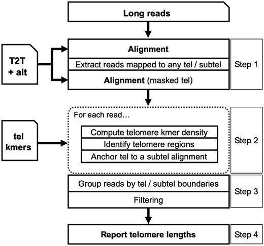
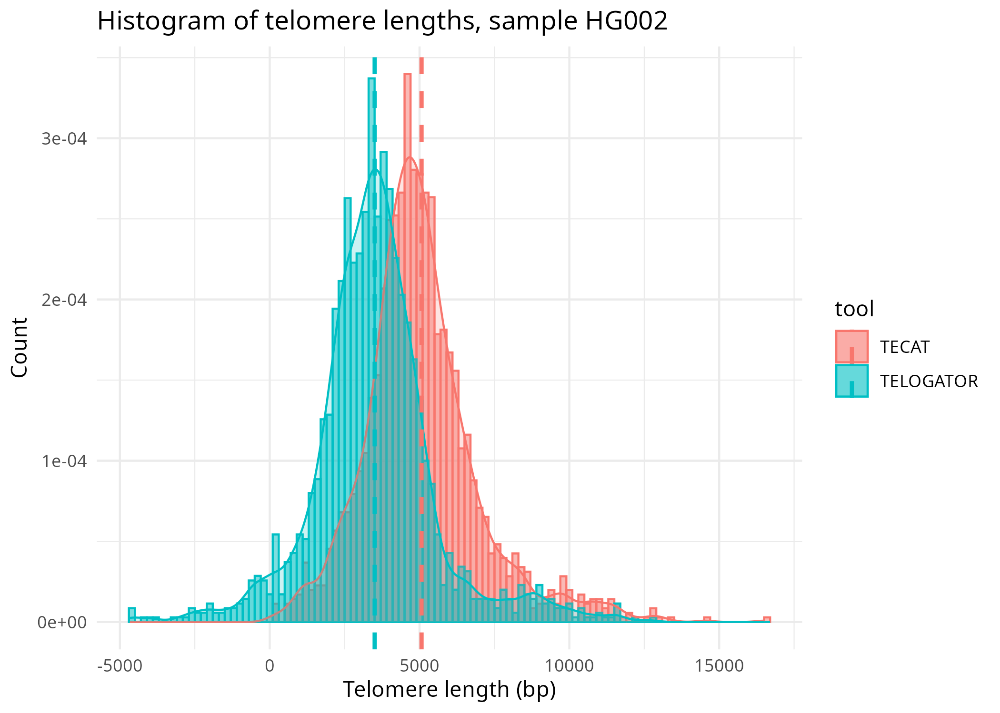

<style type="text/css">
.main-container {
  max-width: 80% !important;
  margin: auto;
}
</style>
# Data 
The data used in this analysis is the results of comparing the telomere end-chromosome length assaying tools TECAT and Telogator, along with the short read analysis tool Telseq. The data used in this analysis is mostly 1000 genomes project data. The data used in this analysis is 1000 genome project samples HG002, HG003, and HG00731 from the 1000 genomes project. The data was processed using the TECAT, Telogator, and Telseq tools. I chose these samples because they had good matched long-read and short-read data. 

# Analysis workflow
1. Load the data
2. Compare Length results from TECAT and Telogator
3. Compare TECAT and Telogator averages to Telseq results
4. Compare time taken to run each tool
5. Visualize the data in violin plots

# Purpose 
The purpose of this analysis is to compare the results of the TECAT and Telogator tools to the Telseq tool.

# Introduction to the analysis
The data used in this analysis is the results of comparing the telomere end-chromosome length assaying tools TECAT and Telogator, along with the short read analysis tool Telseq. Telomere lengths are important in determining FCR treatment response in CLL patients and have been shown to be a prognostic marker in CLL and other cancers. Telomere's are also implicated in aging and neurodegenerative diseases. Normal telomere length varies from 1kb to 15kb depending on age. As of now there are two software packages which measure telomere length at the resolution of individual chromosomes: TECAT and Telogator. Telseq is a short read analysis tool that can be used to measure telomere length. The purpose of including Telseq in this analysis is to provide some type of ground truth for the other two tools.

# Samples
```{r samples}
# Create the data frame, including ineligible rows with a note
data <- data.frame(
  Number = c(1, 2, 3, 4, 5, 6, 7, 8, 9, "-10", "-11", "-12", 10, 11, 12),
  SampleID = c("HG002", "HG003", "HG004", "HG00731", "HG00732", "HG02011", 
               "HG02492", "HG03065", "HG03371", "HG03683", "NA12329", 
               "NA19983", "HG00514", "HG00733", "NA19240"),
  Long_Read_Accession = c("SRR28295757-71", "SRR12898316", "SRR27010837", 
                          "ERR11586165", "ERR4987503-05", "ERR11028132", 
                          "ERR11028099", "ERR11028096", "ERR11028137", 
                          "ERR3861403", "ERR3861409-10", "ERR3861402", 
                          "ERR4982327", "SRR24401966", "ERR3219853-57"),
  Short_Read_Accession = c("SRR14724532", "SRR14724530", "SRR14724529", 
                           "ERR10967205", "ERR3241755", "ERR3988973", 
                           "ERR3989019", "ERR3989118", "ERR3989162", 
                           "ERR3989199", "ERR3989317", "ERR3989454", 
                           "ERR3988781", "SRR5535410-11", "ERR3989410"),
  LR_Type = c("ONT", "ONT", "ONT", "ONT", "PB", "ONT", "ONT", "ONT", 
              "ONT", "PB", "PB", "PB", "PB", "ONT", "ONT"),
  Notes = c("", "", "", "updated SR SRR5534404-5", "", "", "", "", "", 
            "CLR - not eligible", "CLR - not eligible", "CLR - not eligible", "", "", "")
)

# Print the data frame
knitr::kable(data, caption = "20240801 List of Data Sets for Comparative Study")
```

{width=40%}
{width=40%}

<center>

{width=50%}

</center>
```{r setup, include=FALSE}
knitr::opts_chunk$set(echo = TRUE)
options(width = 300)
```


# Libraries
```{r}
library(plyr)
library(tidyverse)
library(knitr)
library(ggplot2)
library(cowplot)
```


# Load the data
```{r fetch_data}
samples <- c("HG002", "HG004", "HG00731", "HG00732", "HG02011", "HG02492", "HG03065")
tecat <- list()
telogator <- list()
telseq <- list()
for(s in samples) {
  tecat[[s]] <- readRDS(file = file.path(paste0(s), "tecat", "mapped.rds"))
  telogator[[s]] <- read.table(file = file.path(paste0(s), "telogator", "tlens_by_allele.tsv"), header = TRUE, sep = "\t", comment.char = "")
  telseq[[s]] <- readLines(file.path(paste0(s), "telseq", "telseq_results.txt"))
}

head(tecat$HG002$results)
dim(telogator$HG002)
dim(tecat$HG002$results)
names(telogator$HG002)
telogator$HG002[1:5,1:6]
```

# Collect telomere lengths
```{r}
tecat_lengths <- list()
telogator_lengths <- list()
telseq_length <- list()
for(s in samples) {
    tecat_lengths[[s]] <- tecat[[s]]$results %>% 
        filter(!is.na(telomere_length)) %>% 
        pull(telomere_length)
    telogator_lengths[[s]] <- as.numeric(unlist(strsplit(telogator[[s]]$read_TLs, ",")))
    telseq_length[[s]] <- as.numeric(unlist(strsplit(telseq[[s]][4], "\t"))[7])
}
```

# Basic plots of data
{width=45%} {width=45%}
```{r, out.width="80%"}
histo_data <- list()
for(s in samples) {
    histo_data[[s]] <- data.frame(
        length = c(tecat_lengths[[s]], telogator_lengths[[s]]),
        tool = c(rep("TECAT", length(tecat_lengths[[s]])), rep("TELOGATOR", length(telogator_lengths[[s]])))
    )
    # Find mean for each tool
    mu <- ddply(histo_data[[s]], "tool", summarise, grp.mean=mean(length))

    hist <- ggplot(histo_data[[s]], aes(x = length, fill = tool, color = tool)) +
         geom_histogram(aes(y=after_stat(density)), alpha=0.5, 
                position="identity", binwidth = 200)+
         geom_density(alpha=.2) + 
         geom_vline(data = mu, aes(xintercept = grp.mean, color = tool), linetype = "dashed", linewidth = 1) +
        labs(title = paste("Histogram of telomere lengths, sample", s),
             x = "Telomere length (bp)",
             y = "Count") +
        theme_minimal()
    print(hist)
    ggsave(file = file.path("./figures", paste0(s, "_histogram.png")), plot = hist)
    
}
```

```{r, out.width="80%"}
library(reshape2)
# Combine histo datas for both samples with sample labels
boxplot <- rbind(
    cbind(histo_data[["HG002"]], sample = "HG002"),
    cbind(histo_data[["HG004"]], sample = "HG004"),
    cbind(histo_data[["HG00731"]], sample = "HG00731"), 
    cbind(histo_data[["HG00732"]], sample = "HG00732"),
    cbind(histo_data[["HG02011"]], sample = "HG02011"),
    cbind(histo_data[["HG02492"]], sample = "HG02492"), 
    cbind(histo_data[["HG03065"]], sample = "HG03065")
)

# Add telseq data to boxplot
boxplot <- rbind(
    boxplot,
    data.frame(
        length = unlist(telseq_length) * 1000,
        tool = rep("TELSEQ", length(unlist(telseq_length))),
        sample = rep(samples, each = 1)
    )
)

ggplot(boxplot, aes(x = sample, y = length, fill = tool)) +
    geom_boxplot(outlier.shape = NA) +
    labs(title = "Boxplot of telomere lengths",
         x = "Sample",
         y = "Telomere length (bp)") +
    theme_minimal()

# Create a plot that shows the difference between each method and the telseq method/tool
# Calculate the mean of each method
tecat_means <- sapply(tecat_lengths, mean)
telogator_means <- sapply(telogator_lengths, mean)
telseq_means <- sapply(telseq_length, mean)

means <- data.frame(
    sample = samples,
    tecat = tecat_means,
    telogator = telogator_means,
    telseq = telseq_means
)

diff <- data.frame(
    sample = samples,
    tecat = means$tecat - means$telseq * 1000,
    telogator = means$telogator - means$telseq * 1000
)

ggplot(melt(diff), aes(x = sample, y = value, fill = variable)) +
    geom_bar(stat = "identity", position = "dodge") +
    labs(title = "Difference in telomere lengths",
         x = "Sample",
         y = "Difference in telomere length (bp)") +
    theme_minimal()

# Mean difference
diff %>% 
    summarise(tecat = abs(mean(tecat)), telogator = abs(mean(telogator)))
# Sum of differences
diff %>% 
    summarise(tecat = abs(sum(tecat)), telogator = abs(sum(telogator)))
```

# Retrieve time taken to run each tool
```{r, out.width="80%"}
tecat_time <- list()
telogator_time <- list()

for(s in samples) {
    tecat_time[[s]] <- as.numeric(strsplit(grep("TECAT time taken", readLines(file.path("../code/logs", paste0(s, ".log"))), value = TRUE), ":")[[1]][2])
    telogator_time[[s]] <- as.numeric(strsplit(grep("Telogator time taken", readLines(file.path("../code/logs", paste0(s, ".log"))), value = TRUE), ":")[[1]][2])
}

time_data <- data.frame()
for(s in samples) {
    time_data <- rbind(
        time_data,
        data.frame(
            time = c(tecat_time[[s]], telogator_time[[s]]),
            tool = c(rep("TECAT", 1), rep("TELOGATOR", 1)),
            sample = c(rep(s, 2))
        )
    )
}

# Summarise data
time_data %>% 
    group_by(tool) %>% 
    summarise(mean_time = mean(time), sd_time = sd(time))

# Convert time from seconds to minutes and label minutes
time_data$time <- time_data$time / 60

# Summarise data again
time_data %>% 
    group_by(tool) %>% 
    summarise(mean_time = mean(time), sd_time = sd(time))

ggplot(time_data, aes(x = tool, y = time, fill = tool)) +
    geom_violin() +
    geom_boxplot(width = 0.1) +
    labs(title = "Time taken to run each tool with 18 threads",
         x = "Tool",
         y = "Time taken (minutes)") +
    theme_minimal()

```

# Violin Plots for Two Tools
```{r violin, fig.width=16, fig.height=10}
# Turn warnings off
options(warn=-1)

for (s in samples) {
  mapped_output <- tecat[[s]]
  left <- mapped_output[["results"]][mapped_output[["results"]]$chromEnd == "5'", ]
  ord <- order(as.numeric(stringr::str_extract(left$ref_name, "\\d+")))
  left <- left[ord, ]
  left$ref_name <- factor(left$ref_name, levels = unique(left$ref_name))
  right <- mapped_output[["results"]][mapped_output[["results"]]$chromEnd == "3'", ]
  ord <- order(as.numeric(stringr::str_extract(right$ref_name, "\\d+")))
  right <- right[ord, ]
  right$ref_name <- factor(right$ref_name, levels = unique(right$ref_name))
  top <- ggplot(left, aes(x = ref_name, y = telomere_length / 1000, fill = chromEnd)) +
    geom_violin(drop = FALSE) +
    geom_boxplot(width = 0.1) +
    scale_fill_manual(values = c("#0091ff")) +
    labs(x = "Chromosome", 
      y = "Telomere Length (kb)", 
      title = paste("TECAT Lengths by Chromosome End 5'", s)) +
      theme(axis.text.x = element_text(angle=90, vjust=.5, hjust=1)) +
      theme(text = element_text(size = 18, family = "Arial"))

  bottom <- ggplot(right, aes(x = ref_name, y = telomere_length / 1000, fill = chromEnd)) +
    geom_violin(drop = FALSE) +
    geom_boxplot(width = 0.1) +
    scale_fill_manual(values = c("#ff00b7")) +
    labs(x = "Chromosome", 
      y = "Telomere Length (kb)", 
      title = paste("TECAT Lengths by Chromosome End 3'", s)) +
      theme(axis.text.x = element_text(angle=90, vjust=.5, hjust=1)) +
      theme(text = element_text(size = 18, family = "Arial"))

  grid <- plot_grid(top, bottom, ncol = 1)
  print(grid)

  ggsave(file = file.path("./figures", paste0(s, "_tecat_violin.png")), plot = grid)

  # Do the same for Telogator
  telogator_output <- telogator[[s]]
  # Split to p and q arms by rows in the data frame
  # Turn telogator output into a long form data frame
  # Isolate just the variables we need
  telogator_output <- telogator_output[, c("X.chr", "read_TLs")]
  telogator_output <- melt(telogator_output, id.vars = "X.chr", value.name = "read_TLs")
  gator_output <- data.frame()
  for (r in 1:nrow(telogator_output)) {
    key <- telogator_output$X.chr[r]
    values <- unlist(strsplit(telogator_output$read_TLs[r], ","))
    for (v in values) {
      gator_output <- rbind(gator_output, data.frame(X.chr = key, read_TLs = as.numeric(v))
      )
    }
  }
  
  p <- gator_output[grepl("p", gator_output$X.chr), ]
  p[["end"]] <- "p"
  q <- gator_output[grepl("q", gator_output$X.chr), ]
  q[["end"]] <- "q"
  
  top <- ggplot(p, aes(x = X.chr, y = read_TLs / 1000, fill = end)) +
    geom_violin(drop = FALSE) +
    geom_boxplot(width = 0.1) +
    scale_fill_manual(values = c("#0091ff")) +
    labs(x = "Chromosome", 
      y = "Telomere Length (kb)", 
      title = paste("Telogator Lengths by Chromosome End p Arm", s)) +
      theme(axis.text.x = element_text(angle=90, vjust=.5, hjust=1)) +
      theme(text = element_text(size = 18, family = "Arial"))

  bottom <- ggplot(q, aes(x = X.chr, y = read_TLs / 1000, fill = end)) +
    geom_violin(drop = FALSE) +
    geom_boxplot(width = 0.1) +
    scale_fill_manual(values = c("#ff00b7")) +
    labs(x = "Chromosome", 
      y = "Telomere Length (kb)", 
      title = paste("Telogator Lengths by Chromosome q Arm", s)) +
      theme(axis.text.x = element_text(angle=90, vjust=.5, hjust=1)) +
      theme(text = element_text(size = 18, family = "Arial"))

  grid <- plot_grid(top, bottom, ncol = 1)
  print(grid)

  ggsave(file = file.path("./figures", paste0(s, "_telogator_violin.png")), plot = grid)
}


```

# Conclusion
The TECAT and Telogator tools produced similar results, with the TECAT tool producing slightly more accurate results based on the results of the Telseq tool and literature data. The TECAT tool also took less time to run than the Telogator tool. 
