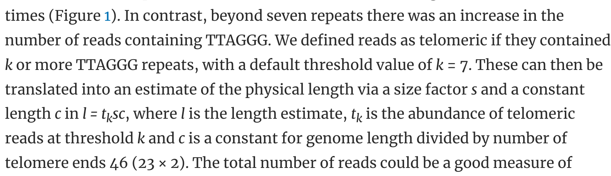
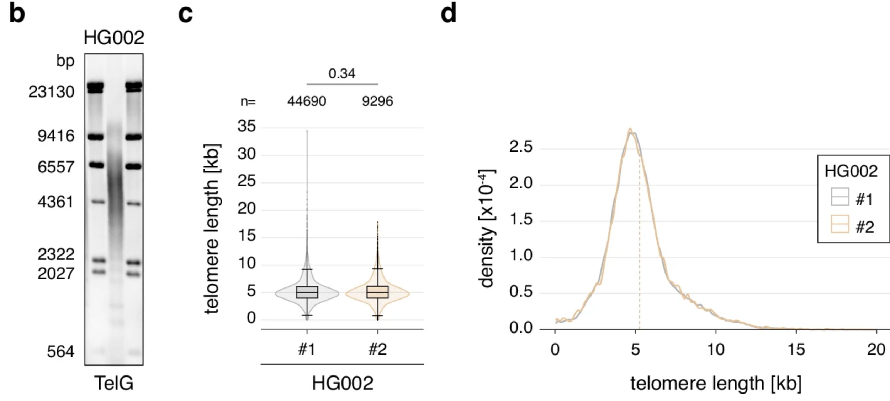
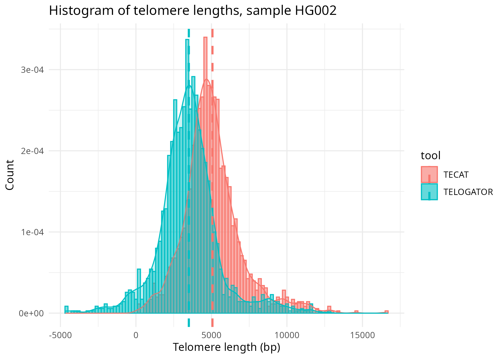

<style>
body {
  color: black;
}
</style>

# Data 
The data used in this analysis is mostly 1000 genomes project data. The data used in this analysis is 1000 genomes project samples HG002, HG003, HG00731, HG00732, HG02011, HG02492, HG03065, HG03371, and HG00514. The data was processed using the TECAT, Telogator, and Telseq tools. I chose these samples because they had matched long-read and short-read data. All the data for the samples was downloaded from the NCBI Sequence Read Archive.

# Analysis workflow
1. Load the data
2. Organize the data
3. Table 1: Datasets
4. Sensitivity
    a) Plot 1
5. Accuracy
    a) Table 2: Descriptive Statistics
    b) Plot 2: Density
    c) Plot 3: Boxplot
    d) Plot 4: Violin
    e) Plot 5: Linear
7. Computational Benchmarks
    a) Table 3: Time Benchmarks
    b) Plot 6: Time Benchmarks
8. CESTLs
    a) Plot 7: CESTLs

# Purpose 
The purpose of this analysis is to compare the results of the long-read sequencing telomere analysis tools TECAT and Telogator to the short-read sequencing tool Telseq.

# Introduction to the analysis
The following analysis is the result of comparing the telomere end-chromosome length assaying tools TECAT and Telogator, along with the short-read analysis tool Telseq. Telomere lengths are important in determining treatment response in chronic lymphocytic leukemia (CLL) patients and have been shown to be a prognostic marker in CLL and other cancers. Telomere length serves as a biomarker in cancer, cardiovascular disease, and neurodegenerative diseases. Normal telomere length varies from 1kb to 15kb depending on age. Currently, there are two software packages that measure telomere length at the resolution of individual chromosomes: TECAT and Telogator. Telseq is a short-read analysis tool that can be used to measure telomere length. The purpose of including Telseq in this analysis is to provide a ground truth for the other two tools.

# Setup
```{r setup}
knitr::opts_chunk$set(echo = TRUE)
knitr::opts_knit$set(root.dir = "/home/jake/science_projects/telo/comparative_study")
```

# Libraries
```{r libraries}
suppressMessages({
    library(tidyverse)
    library(plyr)
    library(knitr)
    library(kableExtra)
    library(ggplot2)
    library(ggpubr)
    library(gridExtra)
    library(cowplot)
    library(reshape2)
})
```

# Long-read Sequencing Tools Workflow
{width=40%}
{width=40%}

<center>

{width=50%}

</center>

# Samples
```{r samples}
# Create the data frame, including ineligible rows with a note
data <- data.frame(
  Number = c(1, 2, 3, 4, 5, 6, 7, 8, 9, "-10", "-11", "-12", 10, 11, 12),
  SampleID = c("HG002", "HG003", "HG004", "HG00731", "HG00732", "HG02011", 
               "HG02492", "HG03065", "HG03371", "HG03683", "NA12329", 
               "NA19983", "HG00514", "HG00733", "NA19240"),
  `Long Read Accession` = c("SRR28295757-71", "SRR12898316", "SRR27010837", 
                          "ERR11586165", "ERR4987503-05", "ERR11028132", 
                          "ERR11028099", "ERR11028096", "ERR11028137", 
                          "ERR3861403", "ERR3861409-10", "ERR3861402", 
                          "ERR4982327", "SRR24401966", "ERR3219853-57"),
  Short_Read_Accession = c("SRR14724532", "SRR14724530", "SRR14724529", 
                           "ERR10967205", "ERR3241755", "ERR3988973", 
                           "ERR3989019", "ERR3989118", "ERR3989162", 
                           "ERR3989199", "ERR3989317", "ERR3989454", 
                           "ERR3988781", "SRR5535410-11", "ERR3989410"),
  Type = c("ONT", "ONT", "ONT", "ONT", "PB", "ONT", "ONT", "ONT", 
              "ONT", "PB", "PB", "PB", "PB", "ONT", "ONT"),
  Notes = c("", "", "", "updated SR SRR5534404-5", "", "", "", "", "", 
            "CLR - not eligible", "CLR - not eligible", "CLR - not eligible", "", "", "")
)

# Remove the samples where the sample number has a negative sign
data <- data[!grepl("-", data$Number), ]
data <- data[, 1:5]
df <- data

# Current samples list
samples <- c("HG002", "HG004", "HG00731", "HG00732", "HG02011", "HG02492", "HG03065", "HG03371", "HG00514")
```

# Table of Samples
```{r table}
sample_table <- kable(df, 
       format = "html",
       col.names = c("Sample Number", "Sample ID", "Long Read Accession", "Short Read Accession", "Type"), 
       row.names = FALSE, 
       align = c("c", "c", "c", "c", "c"), 
       caption = "<font style='font-size:16pt'><b>Table 1</b> Sample Data</font>") %>%
 kable_classic(full_width = FALSE, html_font = "Arial", font_size = 14)
 kableExtra::save_kable(sample_table, file = "./results/paper_figures/sample_table.png", density = 600, zoom = 1.5)

sample_table
```

# Sensitivity
```{r sensitivity}
# Retrieve the data
tecat_reads <- list()
telogator_reads <- list()

for(s in samples) {
    tecat_reads[[s]] <- as.numeric(strsplit(grep("Number of telomeres", readLines(file.path("./code/logs", paste0(s, ".log"))), value = TRUE), ":")[[1]][2])
    telogator_grep <- "^ -"
    line <- grep(telogator_grep, readLines(file.path("./code/logs", paste0(s, ".log"))), value = TRUE)[[3]]
    telogator_reads[[s]] <- as.numeric(gsub("reads", "", strsplit(line, "-->")[[1]][2]) )
}

raw <- data.frame()
for(s in samples) {
    raw <- rbind(raw, data.frame(Sample = s, TECAT = tecat_reads[[s]], Telogator = telogator_reads[[s]]))
}

head(raw)
```

## Plotting sensitivity
```{r plot_sensitivity, fig.align = "center", fig.width = 8, fig.height = 8}
sens <- raw %>%
  gather(key = "Tool", value = "Number of Telomeres Captured", -Sample) %>%
  ggbarplot(x = "Sample", y = "Number of Telomeres Captured", fill = "Tool", 
            position = position_dodge(0.8), 
            title = "Sensitivity of TECAT and Telogator",
            xlab = "Sample",
            ylab = "Number of Telomeres Captured",
            legend.title = "Tool",
            legend.position = "top",
            theme.legend.position = "top",
            theme = theme_pubr(),
            show.values = TRUE) +
            rotate_x_text(45)

sens
```
It appears that Telogator is more sensitive than TECAT in all samples. Telogator captures ~ 31% more telomeres on average than TECAT.

# Accuracy
```{r accuracy}
# Retrieve the data
tecat <- list()
telogator <- list()
telseq <- list()
for(s in samples) {
  tecat[[s]] <- readRDS(file = file.path("results", paste0(s), "tecat", "mapped.rds"))
  telogator[[s]] <- read.table(file = file.path("results", paste0(s), "telogator", "tlens_by_allele.tsv"), header = TRUE, sep = "\t", comment.char = "")
  telseq[[s]] <- readLines(file.path("results", paste0(s), "telseq", "telseq_results.txt"))
}

head(tecat$HG002$results)
dim(telogator$HG002)
dim(tecat$HG002$results)
names(telogator$HG002)
telogator$HG002[1:5,1:6]
```

## Collect telomere lengths
```{r}
tecat_lengths <- list()
telogator_lengths <- list()
telseq_length <- list()
for(s in samples) {
    tecat_lengths[[s]] <- tecat[[s]]$results %>% 
        filter(!is.na(telomere_length)) %>% 
        pull(telomere_length)
    telogator_lengths[[s]] <- as.numeric(unlist(strsplit(telogator[[s]]$read_TLs, ",")))
    telseq_length[[s]] <- as.numeric(unlist(strsplit(telseq[[s]][4], "\t"))[7])
}
```

## Descriptive statistics of each sample
```{r descriptive}

# Create a data frame with the mean, median, and standard deviation of each sample
descriptive <- data.frame(
  Sample = samples,
  TECAT_Mean = sapply(tecat_lengths, mean),
  TECAT_Median = sapply(tecat_lengths, median),
  TECAT_SD = sapply(tecat_lengths, sd),
  TELOGATOR_Mean = sapply(telogator_lengths, mean),
  TELOGATOR_Median = sapply(telogator_lengths, median),
  TELOGATOR_SD = sapply(telogator_lengths, sd),
  TELSEQ_Mean = sapply(telseq_length, mean),
  TELSEQ_Median = sapply(telseq_length, median),
  TELSEQ_SD = sapply(telseq_length, sd)
)

# Create a table with the descriptive statistics
descriptive_table <- kable(descriptive, 
                            format = "html",
                            col.names = c("Sample", "TECAT Mean", "TECAT Median", "TECAT SD", 
                                          "TELOGATOR Mean", "TELOGATOR Median", "TELOGATOR SD", 
                                          "TELSEQ Mean", "TELSEQ Median", "TELSEQ SD"), 
                            row.names = FALSE, 
                            align = c("c", "c", "c", "c", "c", "c", "c", "c", "c", "c"), 
                            caption = "<font style='font-size:16pt'><b>Table 2</b> Descriptive Statistics of Telomere Lengths</font>") %>%
  kable_classic(full_width = FALSE, html_font = "Arial", font_size = 14)

descriptive_table
```

## Accuracy Plots
{width=45%} {width=45%}

When comparing TECAT to terminal restriction fragmentation assays in the literature, it appears that TECAT results in a very similar mean and distribution of telomere lengths.

```{r density, fig.align = "center", fig.width = 12, fig.height = 8}
histo_data <- list()
for(s in samples) {
    histo_data[[s]] <- data.frame(
        length = c(tecat_lengths[[s]], telogator_lengths[[s]]),
        Tool = c(rep("TECAT", length(tecat_lengths[[s]])), rep("TELOGATOR", length(telogator_lengths[[s]])))
    )  
}

# Initially just HG002
hg002 <- histo_data[["HG002"]]
line <- c(5247)
dens <- ggdensity(data = hg002, x = "length", fill = "Tool", 
          add = "mean",
          color = "Tool", 
          rug = TRUE,
          title = "Telomere Lengths from TECAT and Telogator for HG002",
          xlab = "Telomere Length",
          ylab = "Density",
          legend.title = "Tool",
          legend.position = "top",
          theme = theme_pubr())
dens <- dens + geom_vline(aes(xintercept = line, linetype = "Literature")) +
  scale_fill_manual(name = "Tool",
                    values = c("TECAT" = "#F8766D", "TELOGATOR" = "#00BFC4")) +
  scale_linetype_manual(name = "Ground Truth",
                        values = c("Literature" = "dashed")) +
  theme(legend.position = "right")

dens
```
When it comes to this individual very well characterized HG002 sample, TECAT is much closer to the literature telomere lengths than Telogator.

## Boxplot of telomere lengths
```{r boxplot, fig.width = 12, fig.height = 8, fig.align = "center"}
# Combine histo datas for both samples with sample labels
boxplot <- rbind(
    cbind(histo_data[["HG002"]], sample = "HG002"),
    cbind(histo_data[["HG004"]], sample = "HG004"),
    cbind(histo_data[["HG00731"]], sample = "HG00731"), 
    cbind(histo_data[["HG00732"]], sample = "HG00732"),
    cbind(histo_data[["HG02011"]], sample = "HG02011"),
    cbind(histo_data[["HG02492"]], sample = "HG02492"), 
    cbind(histo_data[["HG03065"]], sample = "HG03065"), 
    cbind(histo_data[["HG03371"]], sample = "HG03371"), 
    cbind(histo_data[["HG00514"]], sample = "HG00514")
)

# Add telseq data to boxplot
boxplot <- rbind(
    boxplot,
    data.frame(
        length = unlist(telseq_length) * 1000,
        Tool = rep("TELSEQ", length(unlist(telseq_length))),
        sample = rep(samples, each = 1)
    )
)

boxplot$Tool <- factor(boxplot$Tool, levels = c("TECAT", "TELSEQ", "TELOGATOR"))

box <- ggplot() +
  # Layer for TECAT and TELOGATOR with boxplots
  geom_boxplot(data = subset(boxplot, Tool != "TELSEQ"), 
               aes(x = sample, y = length, fill = Tool, color = Tool, linetype = Tool)) +
  # Layer for TELSEQ with just a line in legend
  geom_boxplot(data = subset(boxplot, Tool == "TELSEQ"),
               aes(x = sample, y = length, color = Tool, linetype = Tool),
               show.legend = TRUE,
               key_glyph = "path") +
  scale_fill_manual(values = c("#F8766D", "#00BFC4", "red")) +
  scale_color_manual(values = c("black", "black", "red")) +
  scale_linetype_manual(values = c("solid", "solid", "dashed")) +
  labs(title = "Telomere Lengths LRS Tools and Telseq",
       x = "Sample",
       y = "Telomere Length (bp)",
       color = "Tool") +
  theme_pubr() +
  theme(legend.position = "top",
        legend.box = "vertical",
        legend.margin = margin(0, 0, 0, 0),  # Reduce margin around each legend
        legend.spacing = unit(0.1, "cm"),     # Reduce space between legends
        legend.key.size = unit(0.8, "lines"), # Make legend keys smaller
        axis.text.x = element_text(angle = 45, hjust = 1))

box

# Perform t-tests for each sample
tecat_tests <- lapply(samples, function(s) {
  wilcox.test(boxplot[["length"]][boxplot[["Tool"]] == "TECAT" & boxplot[["sample"]] == s], 
         mu = boxplot[["length"]][boxplot[["Tool"]] == "TELSEQ" & boxplot[["sample"]] == s])
})

telogator_tests <- lapply(samples, function(s) {
  wilcox.test(boxplot[["length"]][boxplot[["Tool"]] == "TELOGATOR" & boxplot[["sample"]] == s], 
         mu = boxplot[["length"]][boxplot[["Tool"]] == "TELSEQ" & boxplot[["sample"]] == s])
})

# Extract p-values
tecat_pv <- sapply(tecat_tests, function(t) t$p.value)
telogator_pv <- sapply(telogator_tests, function(t) t$p.value)

# Create a data frame with the p-values
p_values_df <- data.frame(
  Sample = samples,
  TECAT = tecat_pv,
  TELOGATOR = telogator_pv
)

# First reshape p_values_df to long format for easier plotting
p_values_df <- tidyr::pivot_longer(p_values_df, 
                                   cols = c("TECAT", "TELOGATOR"),
                                   names_to = "Method", 
                                   values_to = "p_value")

pvalue_plot <- data.frame(
 Sample = samples,
 TECAT = -log10(tecat_pv),
 TELOGATOR = -log10(telogator_pv)
)

# Heatmap with just exponent values
pplot <- ggplot(pvalue_plot, aes(y=Sample)) +
 geom_tile(aes(x="TECAT", fill=TECAT)) +
 geom_tile(aes(x="TELOGATOR", fill=TELOGATOR)) +
 scale_fill_gradientn(
   colors = c("white", "#00FF00", "#000099"),
   name="p-value (10^-x)",
   breaks=seq(0, max(c(pvalue_plot$TECAT, pvalue_plot$TELOGATOR)), length.out=5),
   labels=function(x) round(x)
 ) +
 geom_text(aes(x="TECAT", label=round(TECAT)), color="black", size=3) +
 geom_text(aes(x="TELOGATOR", label=round(TELOGATOR)), color="black", size=3) +
 theme_pubr() +
 labs(x="", y="Sample") +
 ggtitle("P-values: LRS tools and Telseq") + 
 coord_flip() + 
 rotate_x_text(45)


# Create a plot that shows the difference between each method and the telseq method/tool
# Calculate the mean of each method
tecat_means <- sapply(tecat_lengths, mean)
telogator_means <- sapply(telogator_lengths, mean)
telseq_means <- sapply(telseq_length, mean)

means <- data.frame(
    sample = samples,
    tecat = tecat_means,
    telogator = telogator_means,
    telseq = telseq_means
)

diff <- data.frame(
    sample = samples,
    tecat = means$tecat - means$telseq * 1000,
    telogator = means$telogator - means$telseq * 1000
)

diff_plot <- diff %>%
    gather(key = "Tool", value = "Difference", -sample) %>%
    ggbarplot(x = "sample", y = "Difference", fill = "Tool", 
              position = position_dodge(0.8), 
              title = "Difference in Telomere Lengths",
              xlab = "Sample",
              ylab = "Difference in Telomere Length (bp)",
              legend.title = "Tool",
              legend.position = "top",
              theme = theme_pubr(),
              show.values = TRUE) +
              rotate_x_text(45)

# Violin plot of all data with samples combined based on tool
violin_data <- boxplot[, c(1,2)]

# Violin plot with stat comparison
violin <- ggviolin(violin_data, x = "Tool", y = "length", fill = "Tool",
                   palette = c("#F8766D", "#42f606", "#00BFC4"),
                   xlab = "Method",
                   ylab = "Length") +
 stat_compare_means(method = "wilcox.test",
                    comparisons = list(c("TECAT", "TELSEQ"),
                                       c("TELOGATOR", "TELSEQ")),
                    label = "p.signif") +
 geom_boxplot(width = 0.2, outlier.shape = 16) +
 theme_pubr() +
 theme(legend.position = "none") +
 ggtitle("Combined Telomere Lengths")


```

## Show Plots
```{r combine}
diff_plot
pplot
violin

# Mean difference
diff %>% 
    summarise(tecat = abs(mean(tecat)), telogator = abs(mean(telogator)))

# SD of differences
diff %>% 
    summarise(tecat = sd(abs(tecat)), telogator = sd(abs(telogator)))

# Sum of differences
diff %>% 
    summarise(tecat = abs(sum(tecat)), telogator = abs(sum(telogator)))

```

The statistics plot is a heatmap where the colors correspond to statistical significance of a Wilcoxon test with white being non-significant and purple being highly significant. The values are the negative base-10 logarithm of the p-value.

TECAT’s distribution of telomere lengths was not significantly different from Telseq’s distribution (p-value = 0.24) while Telogator’s distribution was significantly different from Telseq’s distribution (p-value = 0.011). This suggests that TECAT ismore accurate in measuring telomere length than Telogator.

For every sample, TECAT is closer to the Telseq value than Telogator. TECAT’s mean telomere length of HG002 is 5067 bp with a standard deviation of 1937 bp which is well within the literature listed length of 5247 to 5270 bp. Telogator’s mean telomere length of HG002 is 3503 bp with a standard deviation of 2050 bp. With regards to accuracy, TECAT outperformed Telogator in terms of mean telomere length, with a mean difference of 1564 bp. The difference in mean telomere length between the two tools was most pronounced in sample HG002, where TECAT’s mean telomere length was within 200 bp of the literature value while Telogator’s mean telomere length was 2000 bp shorter.

# Linear comparison of telomere lengths
```{r linear}
telseq_line <- data.frame(
    sample = samples,
    length = unlist(telseq_length) * 1000,
    tool = rep("TELSEQ", length(unlist(telseq_length)))
)

# Order telse from least to greatest
telseq_line <- telseq_line[order(telseq_line$length), ]
telseq_samples <- telseq_line$sample

# Get means for each tool per sample
tecat_means <- sapply(tecat_lengths, mean)

# Order tecat from least to greatest
tecat_line <- data.frame(
    sample = samples,
    length = tecat_means,
    tool = rep("TECAT", length(tecat_means))
)

# Take sample order from telseq and apply it to tecat 
tecat_line <- tecat_line[match(telseq_samples, tecat_line$sample), ]

# Get means for telogator tool
telogator_means <- sapply(telogator_lengths, mean)

# Order telogator from least to greatest
telogator_line <- data.frame(
    sample = samples,
    length = telogator_means,
    tool = rep("TELOGATOR", length(telogator_means))
)

# Take sample order from telseq and apply it to telogator
telogator_line <- telogator_line[match(telseq_samples, telogator_line$sample), ]

# Combine all data with tool annotations
line_data <- rbind(telseq_line, tecat_line, telogator_line)

# Convert data to long form
line_data <- data.frame(
    sample = rep(samples, 2), 
    x <- rep(telseq_line$length, 2),
    y <- c(tecat_line$length, telogator_line$length), 
    tool = rep(c("TECAT", "TELOGATOR"), each = length(samples))
)
colnames(line_data) <- c("sample", "x", "y", "tool")

# Perform regression for each group
fits <- line_data %>%
  group_by(tool) %>%
  do({
    mod <- lm(y ~ x, data = .)
    data.frame(r2 = summary(mod)$r.squared)
  })

# Plot with group-specific regression lines and R-squared values
lines <- ggplot(line_data, aes(x = x, y = y, color = tool)) +
  geom_point() +
  geom_smooth(method = "lm", se = FALSE, linewidth = 2) +
  annotate("text", x = min(line_data$x) * 3, y = max(line_data$y) * 1.5, 
           label = paste("TECAT R² =", round(fits$r2[fits$tool == "TECAT"], 2)), 
           color = "#F8766D", 
           size = 5, 
           fontface = "bold") +
  annotate("text", x = min(line_data$x) * 3, y = max(line_data$y) * 1.4, 
           label = paste("TELOGATOR R² =", round(fits$r2[fits$tool == "TELOGATOR"], 2)), 
           color = "#00BFC4", 
           size = 5, 
           fontface = "bold") +
  theme_pubr() +
  ggtitle("Linear Comparison of Telomere Lengths") +
  theme(plot.title = element_text(size = 20),
       legend.title = element_text(size = 20),  # Legend title font size
       legend.text = element_text(size = 20)) +
  xlab("Telseq Length") +
  ylab("TECAT and TELOGATOR Lengths") +
  scale_color_manual(values = c("#F8766D", "#00BFC4"))

lines
```

A linear comparison of telomere lengths based on tool. The x-axis is the mean telseq length for each sample and the y-axis is the meanTECAT or Telogator length which is annotated with a red and blueline, respectively. Linear regression was performed and the R-squared value is noted on the plot. The resulting R-squared values are 0.74 and 0.37 for TECAT and Telogator, respectively.

# Time Benchmarks for Each LRS Tool
```{r, out.width="80%"}
tecat_time <- list()
telogator_time <- list()

for(s in samples) {
    tecat_time[[s]] <- as.numeric(strsplit(grep("TECAT time taken", readLines(file.path("./code/logs", paste0(s, ".log"))), value = TRUE), ":")[[1]][2])
    telogator_time[[s]] <- as.numeric(strsplit(grep("Telogator time taken", readLines(file.path("./code/logs", paste0(s, ".log"))), value = TRUE), ":")[[1]][2])
}

time_data <- data.frame()
for(s in samples) {
    time_data <- rbind(
        time_data,
        data.frame(
            time = c(tecat_time[[s]], telogator_time[[s]]),
            tool = c(rep("TECAT", 1), rep("TELOGATOR", 1)),
            sample = c(rep(s, 2))
        )
    )
}

# Convert time from seconds to minutes and label minutes
time_data$time <- time_data$time / 60

# Summarise data again
wide <- pivot_wider(time_data, names_from = tool, values_from = time)

wide %>%
    summarise(tecat = sum(TECAT), telogator = sum(TELOGATOR))

wide %>%
    summarise(tecat = mean(TECAT), telogator = mean(TELOGATOR))

wide %>%
    summarise(tecat = sd(TECAT), telogator = sd(TELOGATOR))

time_violin <- ggviolin(time_data, x = "tool", y = "time", fill = "tool",
          palette = c("#F8766D", "#00BFC4"),
          xlab = "Method",
          ylab = "Time (minutes)", 
          trim = TRUE) +
    geom_boxplot(width = 0.2, outlier.shape = 16) +
    theme_pubr() +
    ggtitle("Time Benchmarks for Each LRS Tool")
  
time_violin
```

# Plot CESTLs
```{r reformat}
dict <- data.frame(
  X.chr = c("chr1p", "chr1q", "chr2p", "chr2q", "chr3p", "chr3q", "chr4p", "chr4q", 
          "chr5p", "chr5q", "chr6p", "chr6q", "chr7p", "chr7q", "chr8p", "chr8q", 
          "chr9p", "chr9q", "chr10p", "chr10q", "chr11p", "chr11q", "chr12p", "chr12q", 
          "chr13q", "chr13p", "chr14q", "chr14p", "chr15q", "chr15p", "chr16p", "chr16q", 
          "chr17p", "chr17q", "chr18p", "chr18q", "chr19p", "chr19q", "chr20p", 
          "chr20q", "chr21q", "chr21p", "chr22q", "chr22p", "chrXp", "chrXq", "chrYp", 
          "chrYq"),
  prime_arm = c("5'", "3'", "5'", "3'", "5'", "3'", "5'", "3'", 
                "5'", "3'", "5'", "3'", "5'", "3'", "5'", "3'", 
                "5'", "3'", "5'", "3'", "5'", "3'", "5'", "3'", 
                "5'", "3'", "5'", "3'", "5'", "3'", "5'", "3'", 
                "5'", "3'", "5'", "3'", "5'", "3'", "5'", "3'", 
                "5'", "3'", "5'", "3'", "5'", "3'", "5'", "3'")
)

# Redo previous plot and use the dictionary to convert all to 5' and 3'
samples <- c("HG002")

for (s in samples) {
  mapped_output <- tecat[[s]]
  left <- mapped_output[["results"]][mapped_output[["results"]]$chromEnd == "5'", ]
  ord <- order(as.numeric(stringr::str_extract(left$ref_name, "\\d+")))
  left <- left[ord, ]
  left$ref_name <- factor(left$ref_name, levels = unique(left$ref_name))
  right <- mapped_output[["results"]][mapped_output[["results"]]$chromEnd == "3'", ]
  ord <- order(as.numeric(stringr::str_extract(right$ref_name, "\\d+")))
  right <- right[ord, ]
  right$ref_name <- factor(right$ref_name, levels = unique(right$ref_name))
  top <- ggplot(left, aes(x = ref_name, y = telomere_length / 1000, fill = chromEnd)) +
    geom_violin(drop = FALSE) +
    geom_boxplot(width = 0.1) +
    scale_fill_manual(values = c("#0091ff")) +
    labs(x = "Chromosome", 
      y = "Telomere Length (kb)", 
      title = paste("TECAT Lengths by Chromosome End 5'", s)) +
      theme(text = element_text(size = 18, family = "Arial")) +
      theme_pubr() +
      theme(axis.text.x = element_text(angle=90, vjust=.5, hjust=1)) +
      theme(legend.position = "none") +
      scale_y_continuous(limits = c(-5, 15))

  bottom <- ggplot(right, aes(x = ref_name, y = telomere_length / 1000, fill = chromEnd)) +
    geom_violin(drop = FALSE) +
    geom_boxplot(width = 0.1) +
    scale_fill_manual(values = c("#ff00b7")) +
    labs(x = "Chromosome", 
      y = "Telomere Length (kb)", 
      title = paste("TECAT Lengths by Chromosome End 3'", s)) + 
      theme(text = element_text(size = 18, family = "Arial")) +
      theme_pubr() +
      theme(axis.text.x = element_text(angle=90, vjust=.5, hjust=1)) +
      theme(legend.position = "none") +
      scale_y_continuous(limits = c(-5, 15))
      

  grid <- plot_grid(top, bottom, ncol = 1)
  tecat <- grid
  print(grid)

  # Do the same for Telogator
  telogator_output <- telogator[[s]]
  # Split to p and q arms by rows in the data frame
  # Turn telogator output into a long form data frame
  # Isolate just the variables we need
  telogator_output <- telogator_output[, c("X.chr", "read_TLs")]
  telogator_output <- melt(telogator_output, id.vars = "X.chr", value.name = "read_TLs")
  gator_output <- data.frame()
  for (r in 1:nrow(telogator_output)) {
    key <- telogator_output$X.chr[r]
    values <- unlist(strsplit(telogator_output$read_TLs[r], ","))
    for (v in values) {
      gator_output <- rbind(gator_output, data.frame(X.chr = key, read_TLs = as.numeric(v))
      )
    }
  }
  
  p <- gator_output[grepl("p", gator_output$X.chr), ]
  p[["end"]] <- "p"
  q <- gator_output[grepl("q", gator_output$X.chr), ]
  q[["end"]] <- "q"
  
  p <- merge(p, dict, by = "X.chr")
  q <- merge(q, dict, by = "X.chr")

  left <- rbind(p[which(p$prime_arm == "5'"), ], q[which(q$prime_arm == "5'"), ])
  ord <- order(as.numeric(stringr::str_extract(left$X.chr, "\\d+")))
  left <- left[ord, ]
  left$X.chr <- factor(left$X.chr, levels = unique(left$X.chr))
  right <- rbind(p[which(p$prime_arm == "3'"), ], q[which(q$prime_arm == "3'"), ])
  ord <- order(as.numeric(stringr::str_extract(right$X.chr, "\\d+")))
  right <- right[ord, ]
  right$X.chr <- factor(right$X.chr, levels = unique(right$X.chr))

  top <- ggplot(left, aes(x = X.chr, y = read_TLs / 1000, fill = prime_arm)) +
    geom_violin(drop = FALSE) +
    geom_boxplot(width = 0.1) +
    scale_fill_manual(values = c("#0091ff")) +
    labs(x = "Chromosome", 
      y = "Telomere Length (kb)", 
      title = paste("Telogator Lengths by Chromosome End 5'", s)) +
      theme(text = element_text(size = 18, family = "Arial")) +
      theme_pubr() +
      theme(axis.text.x = element_text(angle=90, vjust=.5, hjust=1)) +
      theme(legend.position = "none") +
      scale_y_continuous(limits = c(-5, 15))

  bottom <- ggplot(right, aes(x = X.chr, y = read_TLs / 1000, fill = prime_arm)) +
    geom_violin(drop = FALSE) +
    geom_boxplot(width = 0.1) +
    scale_fill_manual(values = c("#ff00b7")) +
    labs(x = "Chromosome", 
      y = "Telomere Length (kb)", 
      title = paste("Telogator Lengths by Chromosome End 3'", s)) +
      theme(text = element_text(size = 18, family = "Arial")) +
      theme_pubr() +
      theme(axis.text.x = element_text(angle=90, vjust=.5, hjust=1)) +
      theme(legend.position = "none") +
      scale_y_continuous(limits = c(-5, 15))

  grid <- plot_grid(top, bottom, ncol = 1)
  telogator <- grid
  print(grid)
}

``` 
